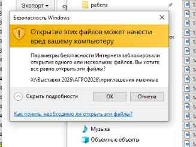
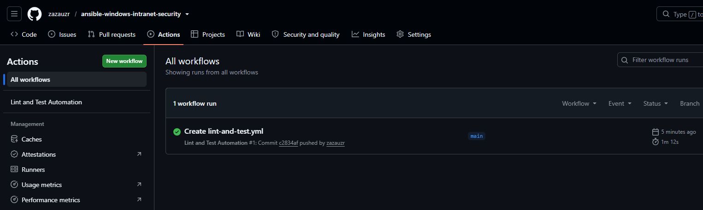
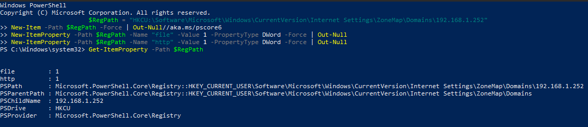

# Windows Intranet Zones Automation (IaC)


A production-ready infrastructure-as-code solution to automate Windows Security Zone configurations on client workstations. This project eliminates annoying and workflow-blocking Windows Security Warnings (*"Opening these files might be harmful to your computer"*) when users access corporate file shares (SMB/NAS).

## Business Problem & Context

In enterprise environments, users frequently access files hosted on internal network-attached storage (NAS) or file servers. By default, Windows systems treat raw IP-based network shares (e.g., `\\192.168.1.252\shares`) as untrusted Internet environments.

**Impact:**
* Users are repeatedly blocked by modal security dialogs when launching applications, documents, or scripts.
* Disruption of routine workflows and elevated volume of Service Desk tickets.
* Automated startup tasks executing from network paths fail or hang without interactive confirmation.

### Baseline Issue


## Architecture & Tech Stack

* **Target OS:** Windows 10 / Windows 11 / Windows Server
* **Configuration Management:** Ansible (`ansible.windows.win_regedit`)
* **Automation Engine:** PowerShell 5.1+ / Core
* **Mechanism:** Registry Mapping under `HKCU:\Software\Microsoft\Windows\CurrentVersion\Internet Settings\ZoneMap`

## Continuous Integration & Testing (CI/CD)

The project includes an automated GitHub Actions pipeline (`.github/workflows/lint-and-test.yml`):
* **Ansible Linting:** Validates playbook formatting and enterprise conventions.
* **PowerShell Code Analysis:** Enforces code quality via `PSScriptAnalyzer`.
* **E2E Validation:** Deploys onto a native `windows-latest` runner and executes registry verification.

### Automated Pipeline Run


## Deployment & Usage

### Option 1: Standalone Execution (PowerShell)
Execute the script under the targeted user context or via an administrative terminal:

```powershell
# Navigate to the script directory
cd scripts/

# Execute configuration against the target internal address
powershell.exe -ExecutionPolicy Bypass -File .\Add-IntranetZone.ps1 -TargetAddress "192.168.1.252"
```

### Option 2: Fleet Deployment (Ansible)
Roll out the configuration across managed endpoints:

```bash
ansible-playbook -i inventory.ini playbooks/configure_intranet_zones.yml
```

## Verification & Healthcheck

To verify that the target address is mapped to the Local Intranet Zone without opening the GUI, run:

```powershell
Get-ItemProperty -Path "HKCU:\Software\Microsoft\Windows\CurrentVersion\Internet Settings\ZoneMap\Domains\192.168.1.252"
```

### Execution Artifact


**Expected Output:**
```text
file         : 1
http         : 1
PSPath       : Microsoft.PowerShell.Core\Registry::HKEY_CURRENT_USER\...
PSChildName  : 192.168.1.252
```
*(Value `1` confirms mapping to Zone 1 / Local Intranet).*

     
## Copyright and License

Copyright (c) 2026 zazauzr. All rights reserved.

This repository and all its contents (including documentation, scripts, and configuration files) are proprietary. Unauthorized copying, modification, distribution, or commercial use of any materials from this repository, via any medium, is strictly prohibited without the express prior written permission of the copyright holder.
